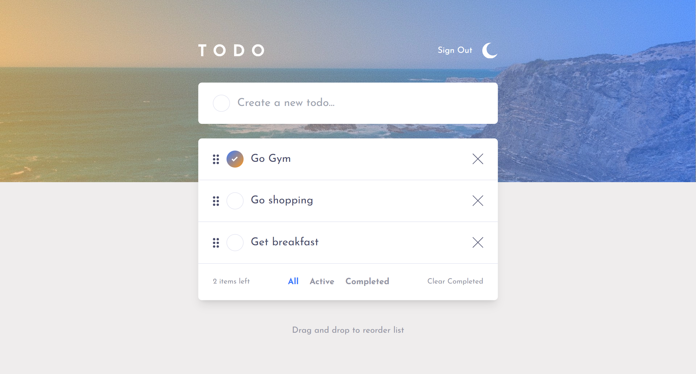

# Todo app

## Table of contents

- [Overview](#overview)
  - [The challenge](#the-challenge)
  - [Screenshot](#screenshot)
  - [Links](#links)
- [My process](#my-process)
  - [Built with](#built-with)
  - [What I learned](#what-i-learned)
  - [Continued development](#continued-development)
  - [Useful resources](#useful-resources)
- [Author](#author)


## Overview

Users can:

- View the optimal layout for the app depending on their device's screen size
- See hover states for all interactive elements on the page
- Add new todos to the list
- Mark todos as complete
- Delete todos from the list
- Filter by all/active/complete todos
- Clear all completed todos
- Toggle light and dark mode
- **Bonus**: Drag and drop to reorder items on the list

### Screenshot



### Links

TO BE ADDED

- Solution URL: [Add solution URL here](https://your-solution-url.com)
- Live Site URL: [Add live site URL here](https://your-live-site-url.com)

## My process

### Built with

- Semantic HTML5 markup
- CSS custom properties
- Flexbox
- CSS Grid
- Mobile-first workflow
- [React](https://reactjs.org/) - JS library
- [Next.js](https://nextjs.org/) - React framework
- [Typescript](https://www.typescriptlang.org/) - Type safety
- [TailwindCSS](https://tailwindcss.com/) - For CSS Utility classes
- [Drizzle](https://orm.drizzle.team/) - Communicating with a relational database
- [Supabase](https://supabase.com/) - Postgres Relational Database & Auth
- [dnd-kit](https://docs.dndkit.com/) - Drag & Drop functionality
- [next-themes](https://www.npmjs.com/package/next-themes) - For light & dark themes


### What I learned

NEEDS TO BE DONE!!!!

Use this section to recap over some of your major learnings while working through this project. Writing these out and providing code samples of areas you want to highlight is a great way to reinforce your own knowledge.

To see how you can add code snippets, see below:

```html
<h1>Some HTML code I'm proud of</h1>
```
```css
.proud-of-this-css {
  color: papayawhip;
}
```
```js
const proudOfThisFunc = () => {
  console.log('🎉')
}
```

### Continued development

The two main takeaways from the project were the use of relational databases and Typescript.

I know I have only touched the surface of learning about relational databases, their concepts, the differents types (postgres, mySQL etc), their uses and how powerful they can be and I looking forward to learning more about them and using them in future Projects. I also feel that it is an important skill to learn as relation databses seem to be so widely used.

Typescript is something I have little experience with as well, but already I'm seeing the benefits of using it in my projects. I plan to use it in all my future Javascript based projects going forward. 

### Useful resources

- [Drizzle Documentation](https://orm.drizzle.team/docs/overview) - As this was my first time working with a relational database and an ORM, I had to use this to set up and connect to the database.

- [Supabase Documentation](https://supabase.com/docs) - I used the supabase documentation to set up my postgres database and manage it. I had to use it quite a bit when creating tables and setting up the projects auth.

- [Typescript documentation](https://www.typescriptlang.org/docs/) - The documentation was something I referenced frequently when I had different type errors I couldn't figure out how to handle.

- [DnD-Kit documentation](https://docs.dndkit.com/presets/sortable#drag-overlay/) - This is what I followed in order to setup the drag & drop functionality for the project.

## Author

- Website - [David Henery](https://www.djhwebdevelopment.com)
- Frontend Mentor - [@David-Henery4](https://www.frontendmentor.io/profile/David-Henery4)
- Linkedin - [Profile](https://www.linkedin.com/in/david-henery-725458241/)